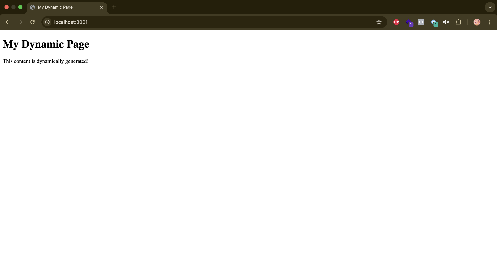

## Ephemeral IP Agent

Repository ini adalah simulasi bagaimana dPanel dapat berkomunikasi dengan mesin yang berada di dalam jaringan private yang tidak memiliki public IP. Contoh penggunaan metode ini salah satunya adalah ketika ingin mengakses Edge Computer (Raspberry Pi / Orange Pi) yang terdapat lokasi client yang tidak memiliki dedicated public IP.

Pertama-tama, edge computer yang akan digunakan harus di install `dPanel Ephemeral IP Agent` sebelum dibawa ke lokasi. Agen ini bertugas untuk menjalin komunikasi dengan `dPanel Manager` secara asyncronous melalui `dPanel Broker Message`. Kemudian jika `dPanel Manager` ingin menjalin komunikasi dengan `Edge Computer`, `dPanel Manager` akan mengirimkan permintaan melalui `dPanel Broker Message` untuk membuka jalur komunikasi di `Edge Computer` melalui `dPanel Public Tunnel`.

Setelah komunikasi terjalin antara `dPanel Ephemeral IP Agent` dan `dPanel Public Tunnel`, `dPanel Manager` dapat mengakses Edge Computer tersebut melalui `dPanel Public Tunnel`. Untuk selanjutnya menjalankan perintah ke dalam edge computer.

### Development

1. Jalankan `public-tunnel` dengan perintah `go run public-tunnel/main.go`
2. Jalankan `ephemeral-ssh-server` dengan perintah `go run private-server/main.go`
3. Jalankan `ephemeral-tunnel-client` dengan perintah `go run client-tunnel/*.go`
4. Akses `Edge Computer` dari `dPanel IaC` dengan perintah `ssh tunnel.beta.devetek.app -p 2221`, dan `https://prakasa-dev.beta.devetek.app` dari `dPanel Manager`

Berdasarkan 4 langkah yang dijalankan. Poin nomor 2 dan 3 adalah proses yang berjalan di dalam `Edge Computer`. Dan diatur oleh `dPanel Ephemeral IP Agent`. Sedangkan point nomor 1 adalah proses yang berjalan di dPanel Server yang diatur oleh `dPanel Manager`. Selanjutnya poin nomor 4 adalah proses yang dijalankan dPanel IaC untuk mengakses `Edge Computer` dan menjalankan perintah yang kita inginkan.

> [TODO]
> 1. Dynamic remote port di tunnel server `dPanel Public Tunnel`
> 2. Menyelesaikan module PAT di dPanel Manager - https://trello.com/c/OYUIwmoK
> 3. Menyelesaikan `dPanel Agent` installer `curl https://artifact.dnocs.io/install.sh | sh -s <YOUR-PAT> ⁠` - https://trello.com/c/O5XTD8Ou
> 4. Membuat tunnel platform (UI / Backend) untuk membuat remote config client tunnel yang sudah terhubung
> 5. Integrasi client tunnel dnegan `Tunnel Platform` untuk mengatur tunnel yang perlu dibuka 
> 6. [Bug] tunnel-client error after tunnel-server restart / re-deploy. Need to restart tunnel-client automatically!

### Architecture

### Appendix
Berikut adalah hasil dari simulasi untuk mengakses ssh server di port `2222` melalui port `2221`.

Dan ini adalah hasil dari simulasi untuk mengakses web server di port `3000` melalui port `3001`.

